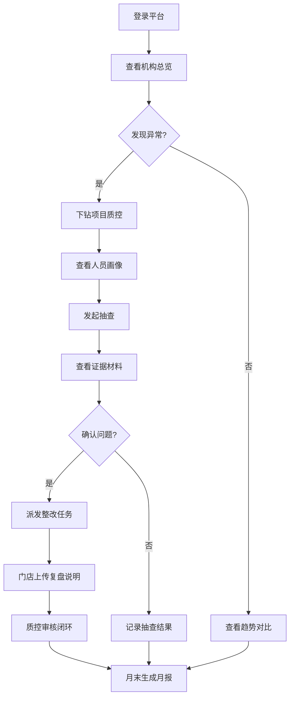
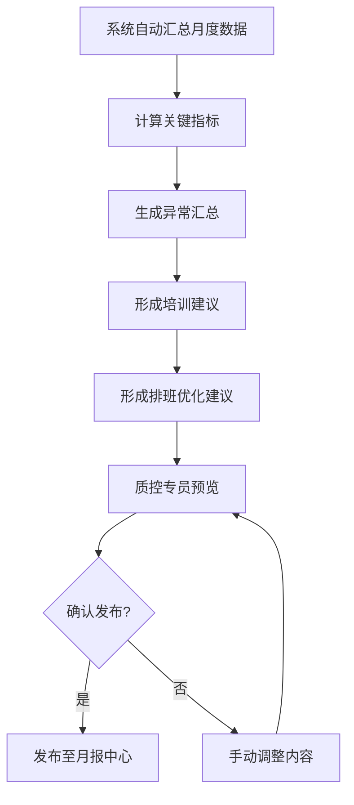

## 1. 产品概述

院内跟台质量复盘 Web 平台，服务连锁医美机构总部护理管理部，聚焦医助跟台过程稳定性与标准动作落地情况，通过数据汇总、项目质控、人员画像、异常闭环、抽查记录与月报自动生成六大模块，帮助总部制定精准的培训和排班规则，实现从"经验驱动"到"数据驱动"的管理升级。

- 目标用户：总部护理管理部质控人员、区域运营总监、门店护士长、医助个人
- 核心价值：将跟台质量从模糊印象变为可量化、可追溯、可复盘的闭环数据体系

## 2. 核心功能

### 2.1 用户角色

| 角色 | 进入方式 | 核心权限 |
|------|----------|----------|
| 总部质控专员 | 管理员分配账号 | 查看全部门店数据、发起抽查、派发整改任务、生成月报 |
| 区域运营总监 | 管理员分配账号 | 查看所属区域门店数据、审批整改说明、查看月报 |
| 门店护士长 | 管理员分配账号 | 查看本店数据、上传复盘说明、查看本店月报 |
| 医助 | 管理员分配账号 | 查看个人画像、查看培训建议、确认整改任务 |

### 2.2 功能模块

1. **机构总览**：多门店跟台KPI仪表盘，含完成率、准点开台率、术前核对缺漏、术中临时补物料次数四大核心指标，支持区域筛选与趋势对比
2. **项目质控**：按医美项目类别查看常见问题，注射类重点看药品批号与部位记录，手术类重点看器械清点和术后交接
3. **人员画像**：每名医助形成能力标签，展示熟练项目、异常高发环节、培训建议及历史趋势
4. **异常闭环**：发现问题后派发整改任务，门店上传复盘说明，追踪整改进度直至闭环
5. **抽查记录**：质控人员可抽查某台的照片、录音摘要和签名确认，记录抽查结果
6. **月报中心**：月报自动生成，含关键指标趋势、异常汇总、培训建议，供院长会使用

### 2.3 页面详情

| 页面名称 | 模块名称 | 功能描述 |
|----------|----------|----------|
| 机构总览 | KPI指标卡 | 展示跟台完成率、准点开台率、术前核对缺漏率、术中补物料次数，支持同比环比 |
| 机构总览 | 门店排名表 | 按综合评分排列各门店，点击可下钻至门店详情 |
| 机构总览 | 趋势图 | 按月/周展示核心指标趋势，支持多门店叠加对比 |
| 机构总览 | 区域筛选 | 按大区、城市、门店三级筛选 |
| 项目质控 | 项目分类卡片 | 注射类/手术类/光电类项目入口，展示各自异常总量 |
| 项目质控 | 注射类质控面板 | 药品批号记录率、部位记录完整率、常见问题TOP5 |
| 项目质控 | 手术类质控面板 | 器械清点合规率、术后交接完成率、常见问题TOP5 |
| 项目质控 | 问题明细表 | 按项目展开问题明细，支持时间范围与门店筛选 |
| 人员画像 | 医助列表 | 按综合能力评分排列，支持搜索与筛选 |
| 人员画像 | 个人画像卡 | 能力雷达图、熟练项目标签、异常高发环节、培训建议 |
| 人员画像 | 历史趋势 | 个人核心指标月度变化曲线 |
| 异常闭环 | 异常看板 | 待处理/处理中/已闭环三类异常统计卡片 |
| 异常闭环 | 整改任务列表 | 展示任务详情、责任门店、截止日期、当前状态 |
| 异常闭环 | 整改详情弹窗 | 查看复盘说明、上传附件、审批闭环 |
| 抽查记录 | 抽查发起 | 选择门店/日期/台次，发起抽查任务 |
| 抽查记录 | 证据查看 | 查看照片、录音摘要、签名确认等证据材料 |
| 抽查记录 | 抽查结果录入 | 填写抽查结论，标记是否合规，关联异常派发 |
| 抽查记录 | 抽查历史 | 按时间/门店/结果筛选历史抽查记录 |
| 月报中心 | 月报列表 | 按月展示已生成月报，支持预览与下载 |
| 月报中心 | 月报详情 | 关键指标趋势图、异常汇总表、培训建议、排班优化建议 |
| 月报中心 | 月报生成 | 一键生成当月报告，支持自定义时间范围 |

## 3. 核心流程

**日常质控闭环流程**：总部质控专员登录平台→查看机构总览发现异常门店→下钻至项目质控定位问题项目→查看人员画像识别薄弱医助→发起抽查调取证据→确认问题后派发整改任务→门店护士长上传复盘说明→质控专员审核闭环→月末自动生成月报。

**月报生成流程**：系统自动汇总当月数据→计算关键指标→生成异常汇总→形成培训与排班建议→质控专员预览→确认后发布至月报中心。

## 4. 用户界面设计

### 4.1 设计风格

- **主色调**：深靛蓝 #1B2A4A（专业可信），辅以冰蓝 #4A9EFF（数据活力）与琥珀橙 #F59E0B（异常警示）
- **背景色**：浅灰白 #F8F9FC 为主背景，卡白 #FFFFFF 为卡片底色
- **按钮风格**：圆角6px，主操作用实心冰蓝，次操作用描边式，危险操作用琥珀橙
- **字体**：标题使用 Noto Sans SC Bold，正文使用 Noto Sans SC Regular，数据展示使用 DM Mono 等宽字体
- **布局**：左侧固定导航栏 + 右侧内容区，卡片化信息布局，数据面板采用网格排列
- **图标**：线性图标风格，统一2px描边，与主色保持一致

### 4.2 页面设计概览

| 页面名称 | 模块名称 | UI 元素 |
|----------|----------|---------|
| 机构总览 | KPI指标卡 | 4张指标卡横排，每张含图标、数值、同比环比箭头、迷你趋势线；冰蓝渐变背景 |
| 机构总览 | 门店排名表 | 条纹交替表格，前三名加金色标识，行可点击展开 |
| 机构总览 | 趋势图 | 折线图，支持hover显示数值，多系列叠加，时间轴可拖拽 |
| 项目质控 | 项目分类卡片 | 三列大卡片，各含项目图标、异常数量气泡、进入箭头 |
| 项目质控 | 质控面板 | 左侧指标仪表盘+右侧问题TOP5柱状图，底部明细表格 |
| 人员画像 | 医助列表 | 卡片网格布局，每张含头像、姓名、能力评分、标签云 |
| 人员画像 | 个人画像卡 | 中央雷达图+周围能力标签+底部培训建议卡片 |
| 异常闭环 | 异常看板 | 三列看板（待处理/处理中/已闭环），每列卡片式任务条 |
| 异常闭环 | 整改详情弹窗 | 模态弹窗，左侧时间线+右侧文件预览区 |
| 抽查记录 | 证据查看 | 照片网格+录音播放条+签名区，侧边结论表单 |
| 月报中心 | 月报详情 | 长页面，指标卡+图表+表格分段展示，顶部固定下载栏 |

### 4.3 响应式

- 桌面优先设计，最小支持1280px宽度
- 平板端（768-1280px）导航栏折叠为汉堡菜单，卡片由4列变2列
- 移动端（<768px）仅保留核心查看功能，操作类引导至PC端

### 4.4 3D 场景

不适用
