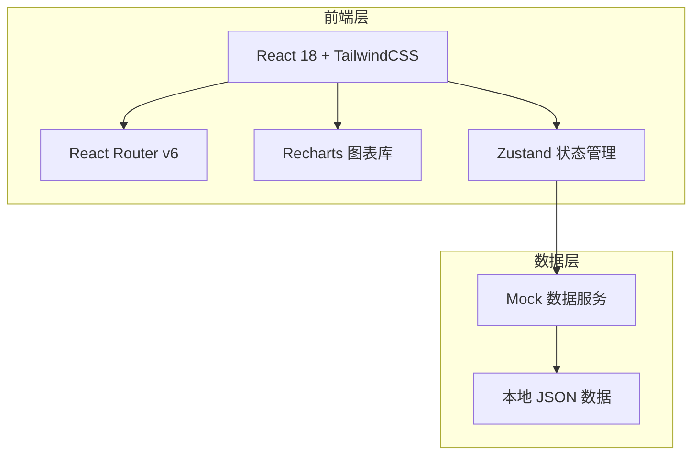
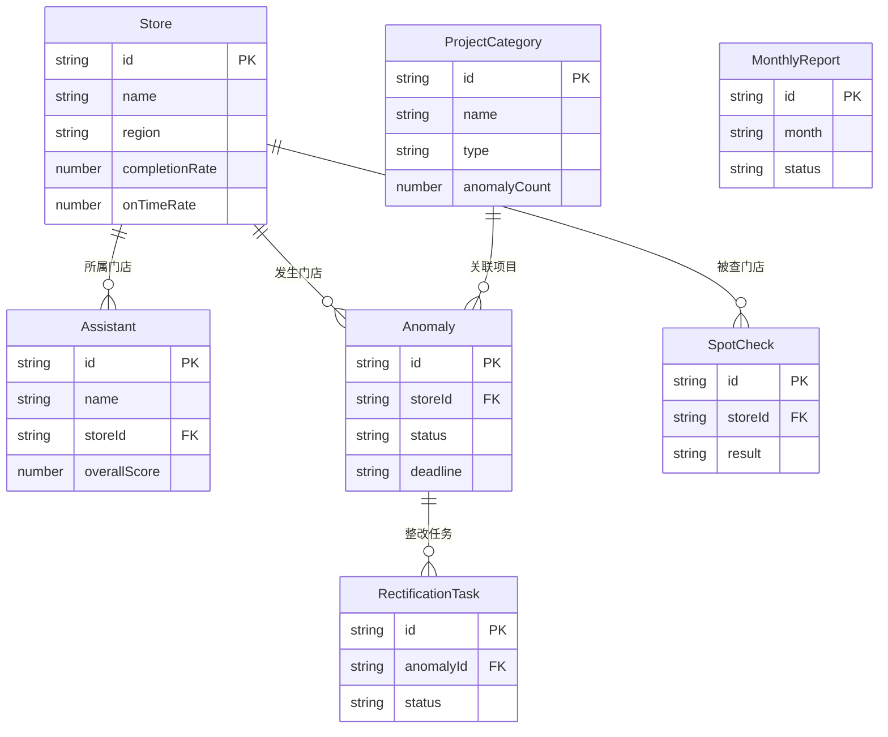

## 1. 架构设计



采用纯前端架构，使用 Mock 数据模拟后端接口，便于后续对接真实 API。

## 2. 技术说明

- **前端框架**：React@18 + TailwindCSS@3 + Vite
- **初始化工具**：Vite (react-ts 模板)
- **路由**：React Router v6
- **状态管理**：Zustand（轻量级，适合中型应用）
- **图表库**：Recharts（基于React的声明式图表）
- **图标库**：Lucide React（线性图标，与设计风格匹配）
- **后端**：无（纯前端 + Mock 数据）
- **数据库**：无（使用本地 JSON 文件模拟）

## 3. 路由定义

| 路由 | 用途 |
|------|------|
| `/` | 重定向至机构总览 |
| `/overview` | 机构总览 - KPI仪表盘、门店排名、趋势对比 |
| `/quality` | 项目质控 - 项目分类、质控面板、问题明细 |
| `/profile` | 人员画像 - 医助列表、个人画像卡、历史趋势 |
| `/anomaly` | 异常闭环 - 异常看板、整改任务列表、整改详情 |
| `/spotcheck` | 抽查记录 - 抽查发起、证据查看、结果录入、历史 |
| `/report` | 月报中心 - 月报列表、月报详情、月报生成 |

## 4. API 定义（Mock 数据接口）

```typescript
interface Store {
  id: string
  name: string
  region: string
  city: string
  completionRate: number
  onTimeRate: number
  preCheckOmissionRate: number
  tempMaterialCount: number
  totalScore: number
  trend: { month: string; completionRate: number; onTimeRate: number }[]
}

interface ProjectCategory {
  id: string
  name: string
  type: 'injection' | 'surgery' | 'laser'
  anomalyCount: number
  metrics: {
    batchRecordRate?: number
    siteRecordRate?: number
    instrumentCheckRate?: number
    handoverRate?: number
  }
  topIssues: { issue: string; count: number }[]
}

interface Assistant {
  id: string
  name: string
  avatar: string
  storeId: string
  storeName: string
  overallScore: number
  proficiencyProjects: string[]
  capabilityTags: { name: string; score: number }[]
  anomalyProneLinks: string[]
  trainingSuggestions: string[]
  trend: { month: string; score: number }[]
}

interface Anomaly {
  id: string
  title: string
  storeId: string
  storeName: string
  projectName: string
  status: 'pending' | 'processing' | 'closed'
  createdAt: string
  deadline: string
  description: string
  rectificationTasks: RectificationTask[]
}

interface RectificationTask {
  id: string
  anomalyId: string
  assignee: string
  status: 'pending' | 'uploaded' | 'approved' | 'rejected'
  reviewNote?: string
  uploadedAt?: string
  attachments: { name: string; type: string; url: string }[]
}

interface SpotCheck {
  id: string
  storeId: string
  storeName: string
  date: string
  assistantName: string
  projectName: string
  result: 'pass' | 'fail' | 'warning'
  photos: { url: string; caption: string }[]
  audioSummary: string
  signatureConfirmed: boolean
  notes: string
  createdAt: string
}

interface MonthlyReport {
  id: string
  month: string
  generatedAt: string
  status: 'draft' | 'published'
  keyMetrics: {
    avgCompletionRate: number
    avgOnTimeRate: number
    totalAnomalies: number
    closedRate: number
  }
  anomalySummary: { category: string; count: number; trend: string }[]
  trainingSuggestions: string[]
  schedulingSuggestions: string[]
}
```

## 5. 服务端架构

不适用（纯前端项目）

## 6. 数据模型

### 6.1 数据模型定义



### 6.2 数据定义语言

使用 TypeScript 接口定义数据结构，Mock 数据以 JSON 文件存储于 `src/data/` 目录下，包含：
- `stores.ts` - 8家门店数据
- `projects.ts` - 3类项目（注射/手术/光电）数据
- `assistants.ts` - 20名医助数据
- `anomalies.ts` - 15条异常记录
- `spotchecks.ts` - 12条抽查记录
- `reports.ts` - 6份月报数据
